# 겹치는 선분의 길이

## 문제 설명

선분 3개가 평행하게 놓여 있습니다. 세 선분의 시작과 끝 좌표가 [[start, end], [start, end], [start, end]] 형태로 들어있는 2차원 배열 `lines`가 매개변수로 주어질 때, 두 개 이상의 선분이 겹치는 부분의 길이를 return 하도록 solution 함수를 완성해보세요.

`lines` 가 [[0, 2], [-3, -1], [-2, 1]]일 때 그림으로 나타내면 다음과 같습니다.

```mermaid
gantt
    title 겹치는 선분의 길이
    dateFormat  X
    axisFormat  %
    A [0, 2]       : 0, 2
    B (-3, -1)     : -3, -1
    C (-2, 1)      : -2, 1
```



선분이 두 개 이상 겹친 곳은 [-2, -1], [0, 1]로 길이 2만큼 겹쳐있습니다.

## 제한사항

- `lines`의 길이 = 3
- `lines`의 원소의 길이 = 2
- 모든 선분은 길이가 1 이상입니다.
- `lines`의 원소는 [a, b] 형태이며, a, b는 각각 선분의 양 끝점 입니다.
  - 100 ≤ a < b ≤ 100

## 입출력 예

| lines                     | result |
| :------------------------ | :----- |
| [[0, 1], [2, 5], [3, 9]]  | 2      |
| [[-1, 1], [1, 3], [3, 9]] | 0      |
| [[0, 5], [3, 9], [1, 10]] | 8      |

## 입출력 예 설명

**입출력 예 #1**

- 두 번째, 세 번째 선분 [2, 5], [3, 9]가 [3, 5] 구간에 겹쳐있으므로 2를 return 합니다.

**입출력 예 #2**

- 겹친 선분이 없으므로 0을 return 합니다.

**입출력 예 #3**

- 첫 번째와 두 번째 선분이 [3, 5] 구간에서 겹칩니다.
- 첫 번째와 세 번째 선분 [1, 5] 구간에서 겹칩니다.
- 두 번째와 세 번째 선분 [3, 9] 구간에서 겹칩니다.
- 따라서 [1, 9] 구간에 두 개 이상의 선분이 겹쳐있으므로, 8을 return 합니다.

## 제공코드

```js
function solution(lines) {
  let answer = 0;
  return answer;
}
```

## 용어학습

### 겹침(overlap)

## 문제분석

1. lines 의 모든 점들을 하나의 배열로 만든다.

2. 가장 작은 값과 가장 큰 값 길이의 배열을 만든다.

3. 해당 line 만큼 해당 좌표에 1 씩 더한다.

4. 최종적으로 2 이상 더해져있는 좌표의 갯수를 구한다.

## 풀이

```js
function solution(lines) {
  let answer = 0;

  const allPoints = lines.flat();

  const min = Math.min(...allPoints);
  const max = Math.max(...allPoints);

  const grid = Array(max - min).fill(0);

  for (const [start, end] of lines) {
    const from = Math.min(start, end);
    const to = Math.max(start, end);

    for (let i = from; i < to; i++) {
      grid[i - min] += 1;
    }
  }

  answer = grid.filter((count) => count >= 2).length;

  return answer;
}
```

## 의문점

### 배열로 처리가 효율적인가?

배열로 처리한 덕분에 문제 풀이가 훨씬 편해졌는데, 이 경우는 -100 ~ 100 사이라고 미리 제한조건이 있었기 때문에 가능한 일이었다.

만약 -1000 ~ 1000 사이의 값이었다면 엄청난 힙메모리를 사용하기 때문에 테스트케이스를 통과하지 못했을 가능성이 높다.

이 경우를 대비해서 다른 해결책은 없는지 조사해보았다.

1.  Map 사용

```js
function solution(lines) {
  const map = new Map();

  for (const [start, end] of lines) {
    const from = Math.min(start, end);
    const to = Math.max(start, end);

    for (let i = from; i < to; i++) {
      map.set(i, (map.get(i) || 0) + 1);
    }
  }

  let answer = 0;
  for (const count of map.values()) {
    if (count >= 2) answer++;
  }

  return answer;
}
```

2. Object 사용

```js
function solution(lines) {
  const counter = {};

  for (const [start, end] of lines) {
    const from = Math.min(start, end);
    const to = Math.max(start, end);

    for (let i = from; i < to; i++) {
      counter[i] = (counter[i] || 0) + 1;
    }
  }

  return Object.values(counter).filter((count) => count >= 2).length;
}
```

3. 정렬-스위핑 알고리즘

```js
function solution(lines) {
  const events = [];

  for (const [start, end] of lines) {
    const from = Math.min(start, end);
    const to = Math.max(start, end);
    events.push([from, 1]);
    events.push([to, -1]);
  }

  events.sort((a, b) => a[0] - b[0]);

  let active = 0;
  let prevX = null;
  let total = 0;

  for (const [x, delta] of events) {
    if (active >= 2 && prevX !== null) {
      total += x - prevX;
    }
    active += delta;
    prevX = x;
  }

  return total;
}
```

**원리 비교**
| 방법 | 시간복잡도 | 원리 |
| :---- | :---- | :----|
| Map | O(N \* R) | 각 선분의 범위 \[from, to\] 를 1칸씩 순회하며 Map의 key(좌표)에 등장 횟수를 누적|
| Object | O(N\*R) | Map과 동일하지만, JS의 기본 객체로 key를 문자열로 저장|
| 스위핑 | O(N log N) |선분의 시작점에 +1, 끝점에 -1 이벤트로 저장하고 x좌표 기준 정렬스위핑하며 겹침 계산|

**성능 비교**
| 조건 | 배열 | Map/Object | 스위핑 |
| :---- | :----: | :----: | :----: |
|메모리|높음|적음|매우 적음|
| 속도(짧은 선분) | 빠름 | 빠름 | 조금 느림|
| 속도(긴 선분) | 느림 | 느림 | 빠름 |
|복잡도 | 낮음 | 낮음 | 중간~높음 |
